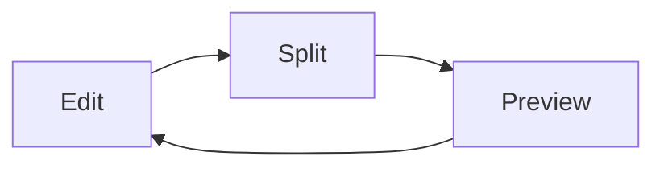

# Markdown Preview Ultra

A Markdown preview of its own — not an extension of VS Code's built-in one.
Markdown is parsed and rendered to HTML in the extension host by a Rust engine
([comrak](https://github.com/kivikakk/comrak)) compiled to WebAssembly; the
webview receives a per-block patch script rather than a whole new page, so
typing in a long document repaints only the paragraph you are editing.

## Features

- **Two preview surfaces.** A *following panel* that opens beside the editor
  and retargets itself to whichever Markdown file you activate, and a
  *full-tab preview editor* that shows one file for the life of its tab. Both
  draw the same page from the same engine instance.

- **Edit / Split / Preview modes.** Split is source and preview side by side;
  Preview replaces the source *inside its own tab* rather than opening a
  second one, so switching views never widens the tab bar. The current mode
  sits in the status bar (click it to switch) and as Edit/Split/Preview icons
  in the editor title bar.

- **Markdown**: CommonMark via comrak, with tables, strikethrough, task lists
  (relaxed matching), footnotes, description lists, multi-line block quotes,
  GitHub alerts, `:shortcode:` emoji, YAML front matter, autolinking,
  optional smart punctuation, optional hard line breaks, and optional
  `[[wiki links]]`. A `[TOC]` paragraph is replaced by a generated
  table of contents. Headings get GitHub-compatible slugs, deduplicated across
  the whole document.

- **Math with KaTeX**: `$inline$` and `$$display$$`. Rendered in the webview
  with `throwOnError: false`, so a bad formula shows its error where it stands
  instead of blanking the page. Results are cached per formula.

- **Mermaid diagrams** from ```` ```mermaid ```` fences. Mermaid is a large
  library, so it is loaded lazily the first time a document actually contains a
  diagram; rendered SVG is cached per source and theme, and a diagram that takes
  more than ten seconds is abandoned rather than allowed to wedge the preview.

- **Syntax highlighting** for fenced code from highlight.js's `common` bundle
  (about 40 languages), plus a Cap'n Proto grammar registered by this extension
  since highlight.js ships none.

- **Two-way scroll sync.** Scrolling the editor moves the preview and vice
  versa, using a source-position map built from the `data-sourcepos` attributes
  the engine emits. Double-click any block in the preview to put the cursor on
  its source line.

- **Table-of-contents sidebar**, slid in from the right by the `☰` button. The
  heading you are reading is highlighted as you scroll, and the sidebar's left
  edge is a drag sash (double-click it to reset to the configured width).

- **A floating toolbar** in the top-right of every preview: back/forward
  through the preview's own link history (hidden until there is somewhere to
  go), `✎` to hand the tab back to the text editor, `☾`/`☀` to flip
  light/dark, `Aa` to flip between the reading font and the editor font, and
  `☰` for the contents sidebar. The two switches override the corresponding
  settings without writing them — see below.

- **Reading conveniences**: a Copy button on every code fence, a hover `¶`
  anchor on every heading that copies its link, click-to-zoom lightbox on
  images, `ctrl`/`cmd` `+` / `-` / `0` to scale the page (0.5×–3×, remembered
  per tab), and a front-matter card that lists your YAML keys and values above
  the document.

- **Links behave like a browser.** `http`, `https` and `mailto` links open
  externally. A relative link to another Markdown file is followed *in the
  preview*, pushing the old file onto a 50-entry back stack; anything else
  opens in the editor. `#anchor` links scroll the page.

- **Raw HTML is always sanitized** — an allowlist of tags and attributes
  (via [ammonia](https://github.com/rust-ammonia/ammonia)), with `href`, `src`,
  `srcset` and `cite` restricted to `http`, `https`, `mailto` and `data`.
  Turning `markdownPreviewUltra.html.enabled` off escapes raw HTML instead of
  rendering it; it does not enable anything.

- **Read-only by default.** The extension has exactly one write path — clicking
  a task-list checkbox in the preview to flip `[ ]`/`[x]` in the file — and it
  is off until you set `markdownPreviewUltra.taskLists.toggleFromPreview`.

Files with the extensions `.md`, `.markdown`, `.mdx` and `.copilotmd` are
previewable, as is any document whose language is `markdown` or `mdx`.
`.copilotmd` is registered as Markdown by this extension. MDX content is
rendered as plain Markdown — MDX-specific syntax is not interpreted — and the
full-tab preview editor is bound to `.md`, `.markdown` and `.copilotmd` only.

## Opening Markdown straight into the preview

The extension ships a contributed default that points Markdown files at its
preview editor:

```jsonc
"workbench.editorAssociations": {
  "*.md": "markdownPreviewUltra.editor",
  "*.markdown": "markdownPreviewUltra.editor",
  "*.copilotmd": "markdownPreviewUltra.editor"
}
```

So opening a `.md` file gives you the rendered page immediately, with no flash
of source and no extra tab. Two cases are handed straight back to the text
editor: a file opened into the source column while you are reading in Split
(you asked for that file, not for a different layout), and a file opened from
the Search view (the preview would lose the match, so the source opens on it
instead).

To open Markdown as text again, set the association yourself in your settings:

```jsonc
"workbench.editorAssociations": { "*.md": "default" }
```

## Alerts, math, diagrams

GitHub-style alerts:

```markdown
> [!WARNING]
> This is rendered with a coloured left border and a title.
```

Math, when `markdownPreviewUltra.math.enabled` is on:

```markdown
Inline $e^{i\pi} + 1 = 0$ and display:

$$\int_0^\infty e^{-x^2}\,dx = \frac{\sqrt{\pi}}{2}$$
```

Diagrams, when `markdownPreviewUltra.mermaid.enabled` is on:

````markdown

````

A paragraph that is nothing but `[TOC]` becomes an inline contents list built
from the document's headings.

## The theme and font switches

The `☾`/`☀` and `Aa` buttons are deviations from `markdownPreviewUltra.theme`
and `markdownPreviewUltra.font`, never writes to them. A flip is held for the
whole window — it carries across files, across both preview surfaces, and
across a window reload — and it is dropped as soon as you change the setting it
deviates from by hand. That is also the way back to `auto`.

## Settings

| Setting | Default | Description |
| --- | --- | --- |
| `markdownPreviewUltra.scrollSync` | `true` | Two-way scroll sync between the editor and the preview |
| `markdownPreviewUltra.lockPreviewGroup` | `true` | Lock the editor group a side preview opens in, so newly-opened files land in the main group instead of replacing the preview |
| `markdownPreviewUltra.defaultMode` | `"split"` | View mode used when opening a preview without an explicit placement; `split` or `preview` |
| `markdownPreviewUltra.breaks` | `false` | Render a single newline inside a paragraph as a line break |
| `markdownPreviewUltra.linkify` | `true` | Turn bare URLs into clickable links |
| `markdownPreviewUltra.typographer` | `false` | Smart punctuation: curly quotes, dashes, ellipses |
| `markdownPreviewUltra.html.enabled` | `true` | Render raw HTML (always sanitized); when off, raw HTML is shown escaped |
| `markdownPreviewUltra.math.enabled` | `true` | Render `$inline$` and `$$display$$` math with KaTeX |
| `markdownPreviewUltra.mermaid.enabled` | `true` | Render ```` ```mermaid ```` fences as diagrams |
| `markdownPreviewUltra.mermaid.theme` | `"auto"` | Mermaid theme: `auto`, `default`, `dark`, `forest`, `neutral`. `auto` follows the preview theme |
| `markdownPreviewUltra.alerts.enabled` | `true` | Render GitHub alerts (`> [!NOTE]`, `> [!WARNING]`, …) |
| `markdownPreviewUltra.emoji.enabled` | `true` | Render `:shortcode:` emoji as Unicode |
| `markdownPreviewUltra.frontmatter.display` | `"card"` | Show leading YAML front matter as a `card`, or `hidden` |
| `markdownPreviewUltra.theme` | `"github-light"` | Preview theme: `auto`, `github-light`, `github-dark`. `auto` follows the VS Code color theme |
| `markdownPreviewUltra.font` | `"proportional"` | `proportional` uses the theme's reading font, `monospace` uses `editor.fontFamily`. Code blocks are monospace either way |
| `markdownPreviewUltra.customCss` | `[]` | Workspace-relative CSS files appended to the preview, in order |
| `markdownPreviewUltra.toc.visible` | `false` | Show the table-of-contents sidebar by default |
| `markdownPreviewUltra.toc.width` | `240` | Default sidebar width in pixels (140–720); drag its left edge to resize |
| `markdownPreviewUltra.taskLists.toggleFromPreview` | `false` | Allow clicking task-list checkboxes in the preview to toggle `[ ]`/`[x]` in the file |
| `markdownPreviewUltra.wikiLinks.enabled` | `false` | Render `[[wiki links]]` as relative links (rendering only, no resolution) |

For a font of your own, point `markdownPreviewUltra.customCss` at a file that
sets `body { font-family: … }`.

## Commands

All commands are under the **Markdown Preview Ultra** category.

| Title | Command id |
| --- | --- |
| Open Preview | `markdownPreviewUltra.showPreview` |
| Open Preview to the Side | `markdownPreviewUltra.showPreviewToSide` |
| Toggle Focus Between Editor and Preview | `markdownPreviewUltra.toggleFocus` |
| Toggle Preview Pin (Follow Active Editor) | `markdownPreviewUltra.togglePreviewLock` |
| Go Back (Preview Link History) | `markdownPreviewUltra.navigateBack` |
| Go Forward (Preview Link History) | `markdownPreviewUltra.navigateForward` |
| Cycle View Mode (Edit / Split / Preview) | `markdownPreviewUltra.cycleMode` |
| Toggle Edit / Preview View | `markdownPreviewUltra.toggleEditPreview` |
| Switch View Mode… | `markdownPreviewUltra.switchMode` |
| Switch to Edit View | `markdownPreviewUltra.setModeEdit` |
| Switch to Split View | `markdownPreviewUltra.setModeSplit` |
| Switch to Preview View | `markdownPreviewUltra.setModePreview` |

**Open Preview** is also on the explorer context menu for Markdown files.
Pinning (**Toggle Preview Pin**) stops the following panel from retargeting
itself when you activate another Markdown editor; a pinned preview shows a 📌
in its tab title, and its Markdown links open in the editor rather than
replacing the page.

## Keybindings

| Keys (Windows/Linux) | Keys (macOS) | Command |
| --- | --- | --- |
| `ctrl+k v` | `cmd+k v` | Open Preview to the Side |
| `ctrl+shift+v` | `cmd+shift+v` | Switch to Split View |
| `ctrl+k ctrl+p` | `cmd+k cmd+p` | Toggle Edit / Preview View |
| `ctrl+k ctrl+m` | `cmd+k cmd+m` | Cycle View Mode |
| `ctrl+k ctrl+v` | `cmd+k cmd+v` | Toggle Focus Between Editor and Preview |
| `ctrl+k ctrl+l` | `cmd+k cmd+l` | Toggle Preview Pin |
| `alt+left` | `ctrl+alt+-` | Go Back (with the preview panel focused) |
| `alt+right` | `ctrl+alt+shift+-` | Go Forward (with the preview panel focused) |

Inside a focused preview, `ctrl`/`cmd` with `+`, `-` or `0` zooms the page, and
`esc` closes the image lightbox.
